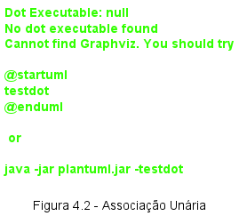
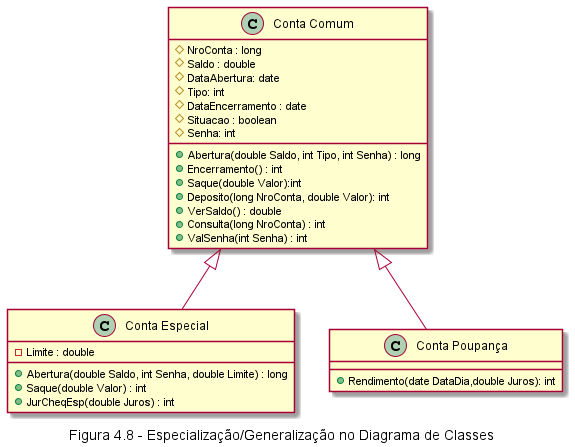

# Diagram de Classes
Ele permite a visualização das classes que vão compor o sistema com seus respectivos atributos, métodos e relação entre as demais classes.

## 4.1 - Persistência.
Ver Livro

## 4.2 - Classes, Atributos e Métodos
Classes são a representação de algo, elas possuem atributos que armazenam valores (estados) e os metódos que são suas funções (ações que executam).

Na UML o diagrama de classes não se preocupa em defininir que etapas esses métodos deverão percorrer quando forem chamados, sendo essa uma função atribuida a outros diagramas.

Na UML uma classe é representada através de um retângulo **com até 3 divisões** (não obrigatoriamente haverá as 3).

1. Contém o nome da Classe.
2. Atributos e seus tipos de dados
3. Métodos.

Conforme o exemplo abaixo:

## 4.3 - Relacionamentos
As classes costumam se relacionar como uma forma de compartilharem informações e processos entre si, de forma a a colaborarem umas com as outras

### 4.3.1 - Associações
Associações descrevem o tipo de vínculo que ocorre entre as classes.
Elas podem ser:

**unárias** -> auto relacionamento

**binárias** -> Duas classes

**ternária ou N-ária** -> Três ou mais classes envolvidas

As associações representam um equivalente mais próximo do MER (Modelo Entidade Relacionamento), ou seja, seu objetivo é definir a maneira como as classes estão unidas e interagem entre si, compartilhando informações.
Elas são representadas por retas como no diagrama de caso de uso e também pode conter setas indicando sua navegabilidade (sentido da informação entre classes envolvidas) *não obrigatório.

Essas retas também podem conter títulos para determinar o tipo de vínculo entre as classes.

#### Associação Unária ou Reflexiva

Relação de uma classe com ela própria

CódigoChefe é a referencia de si próprio nesse caso (maiores esclarecimentos no livro)

|Multiplicidade|Significado
|:--: | :---|
0..1 |No mínimo zero (nenhum) e no máximo 1. Indica que os objetos das classes associadas não precisam obrigatoriamente estar relacionados. Mas se houver relacionamento indica que apenas uma instância da classe se relaciona com as instâncias da outra classe.
1..1 | Um e Somente um. Indica que apenas um objeto da classe se relaciona com os objetos da outra classe.
0..* | No mínimo nenhum e no máximo muitos. Indica que pode ou não haver instâncias da classe participando do relacionamento
\* | Muitos. Indica que muitos objetos da classe estão envolvidos no relacionamento.
1..* | No mínimo 1 e no máximo muitos. Indica que há pelo menos um objeto envolvido no relacionamento, podendo haver muitos envolvidos.
3..5| No mínimo 3 e no máximo 5. Indica que existem pelo menos 3 instâncias envolvidas no relacionamento e que podem ser 4 ou 5 as instâncias envolvidas, mas não mais que isso.

#### Associação Binária
Descrevem o relacionamento entre duas classes.(É a mais comum nos diagramas)

.

Podemos utilizar uma descricão, assim como sua direção de navegabilidade.

.

**obs.: Maiores esclarecimentos no livro **

#### Associação Ternária ou N-ária
São Associações que conectam mais de duas classes

.

#### Agregação

A agregação acontece quando as informações de um objeto(chamado objeto-todo) precisa ser complementada por um ou mais objetos de outra classe(objeto-parte).
A parte pode ser compartilhada por vários objetos.

.

#### Composição

Composição ocorre quando o vínculo entre Todo/Parte, são inteiramente dependentes, o objeto parte nesse caso, pertence totalmente ao objeto todo. A parte não existe sem o todo.

.

#### Especialização/Generalização
Bem esse é o bom e velho conceito de Herança do OOP, mas voltado para um diagrama ;)
.

### Dependência
Não é tão comum nos diagramas de classe, mas ele representa o grau de dependÊncia de uma classe em relação a outra, no caso, sempre que houver uma mudança de estado em uma classe, a outra classe também sofrerá uma mudança.

### Realização
Demonstra a utilização de interfaces.

