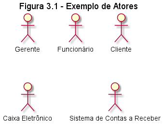
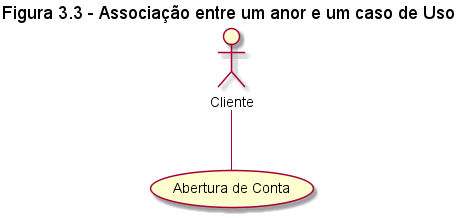
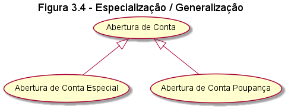
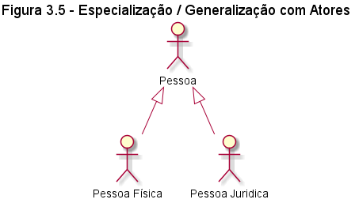

# Diagrama de Casos de Uso

Tenta através de uma linguagem simples transmitir a compreensão do comportamento externo do sistema por qualquer pessoa (perpspectiva do usuário).
Ele é o mais abstrato dos diagramas portanto o mais informal e flexível.
Auxilia na especificação, visualição e documentação das características, funções e serviços do sistema desejados pelos usuários.

## Atores
Os atores representam os papéis desempenhados por usuários, algum hardware especial ou até mesmo outro software que interagem com o sistema.

## Casos de Uso
São usados para uma descrição alto nível de um serviço, tarefas ou funções que podem ser utilizados dentro de alguma maneira dentro de um sistema, ele expressa e documenta  os comportamentos pretendidos para as funções dos sistemas

## Documentação de Caso de Uso

Costuma ser uma descrição suscinta e simples, quais atores fazem  interação com caso de uso, parâmetros fornecidos para sua execução, restrições, validações ele possui.

**observação .:** Não existe um padrão de documento ou mesmo um formato para essa documentação, no entanto, o livro propõe o seguinte modelo.

Caso de Uso| Colocar aqui no nome do caso de uso
 --- | --- 
`Caso de Uso Geral` | preencher
`Ator principal` | preencher
`Ator Secundário` | preencher
`Resumo` | preencher
`Pré-Condições` | preencher
`Pós-Condições` | preencher
**Ações do Ator** | **Ações do Sistema**

Segue um exemplo de uma documentação de caso de uso.

Caso de Uso| Abertura de Conta
 --- | --- 
`Caso de Uso Geral` | 
`Ator principal` | Cliente
`Ator Secundário` | Funcionário
`Resumo` | Este caso de uso descreve as etapas percorridas por um cliente para abrir uma conta corrente
`Pré-Condições` | Pedido de abertura de conta aprovado
`Pós-Condições` | É necessário realizar um deposito
**Ações do Ator** | **Ações do Sistema**
1\. Solicitar abertura de Conta | &nbsp;
 &nbsp; | 2\. Consultar Cliente por seu CPF
 &nbsp; | 3\. Se for necessário, gravar ou atualizar o cadastro. Se o cliente não possuir outras contas deve ser registrado como inativo
 &nbsp; | 4\. Avaliar o pedido do cliente
 &nbsp; | 5\. Aprovar o pedido
 6\. Escolher a senha da conta | &nbsp;
 &nbsp; | 7\. Abrir conta
 &nbsp; | 8\. Denifir Cliente como Ativo
 9\. Fornecer valor a ser depositado | &nbsp;
 &nbsp; | 10\. Registrar depósito
 &nbsp; | 11\. Emitir cartão da Conta
 `Restriçôes/Validações` | 1. Para abrir uma conta corrente é preciso ser maior de idade   2. O valor minimo de depósito é R$ 5,00

## Associações

Represetam as intereções ou relacionamentos entre Atores/Casos de Uso que fazem parte do diagrama.

### Especialização/Generalização
São utilizados para o reaproveitamento de uma Caso de Uso

